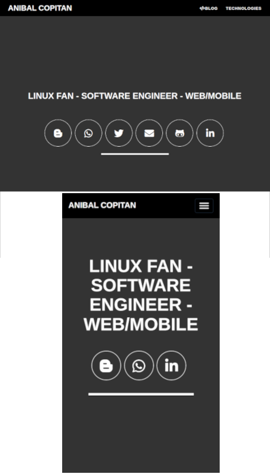
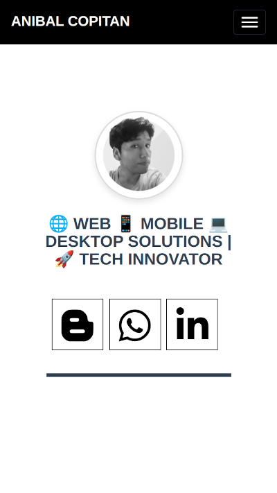

# Website | with NuxtJs - Vue

[source project reference](http://startbootstrap.com/template-overviews/freelancer/)

Web project 2014, all list timeline, Seo application

## 01. docker installation (recommended)

    # Create Image from `Dockerfile`
    cd app-frontend
    docker build -t anibalcopitan.com .
    docker run -it --rm -p 3000:3000 -v "$PWD":/usr/app:rw anibalcopitan.com sh -c 'yarn install & yarn dev'

## 01.1 if fail the previus command

You needed debuger step to step the image `Dockerfile` or docker command

```bash
    cd app-frontend
    docker build -t anibalcopitan.com .
    docker run -it --rm -p 3000:3000 -v "$PWD":/usr/app:rw anibalcopitan.com sh
    # into bash
    yarn install
    yarn dev
```
Explain last command line docker (building the temporal container) (development mood)

* `-it`             => Iteractive container
* `--rm`            => autoremove container to close iteractive docker console
* `-p 3000:3000`    => used and open container port
* `-v "$PWD":/usr/app:rw`    => indicate the volume (persistent data)
* `anibalcopitan.com`                   => is the image named
* `sh -c 'yarn install & yarn dev'`     => way to execute the bash command

### Addicional information

Into container box

```bash
    docker exec -i -t <dd28fae674bb> sh
    # yarn dev
    # yarn build
    # yarn generate
    # cp -r ./app-frontend/dist/* ./docs/.
```

Now the project is available in the local URL: `http://localhost:3000/`

### website

v1: simple integration


v2: Custom font and color black and white



v3: Marca personal simple the first view (desktop/mobile)



## Configuration

mv .env.dist .env
