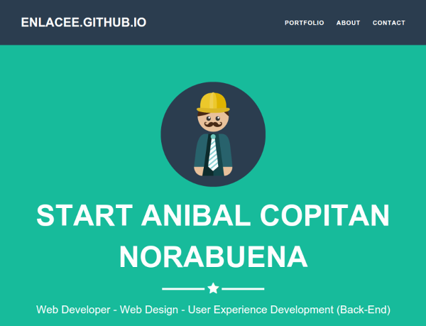

# Portfolio | Project Spa web with NuxtJs

[source project reference](http://startbootstrap.com/template-overviews/freelancer/)

Web project 2014, all list timeline, Seo application

## 01. docker installation (recommended)

    # Create Image from `Dockerfile`
    docker build -t anibalcopitan.com .
    docker run -it --rm -p 3000:3000 -v "$PWD"/spa-nuxtv2:/usr/app:rw anibalcopitan.com sh -c 'yarn install & yarn dev'

Explain last command line docker (building the temporal container) (development mood)

* `-it`             => Iteractive container
* `--rm`            => autoremove container to close iteractive docker console
* `-p 3000:3000`    => used and open container port
* `-v "$PWD"/spa-nuxtv2:/usr/app:rw`    => indicate the volume (persistent data)
* `anibalcopitan.com`                   => is the image named
* `sh -c 'yarn install & yarn dev'`     => way to execute the bash command

### Addicional information

Into container box

```bash
    docker exec -i -t <dd28fae674bb> sh
    # yarn dev
```

Now the project is available in the local URL: `http://localhost:3000/`

### thumb website




## 02. simple Installation

Start application:

    cd spa-nuxtv2/
    yarn dev

## Configuration

mv ./spa-nuxtv2/.env.dist ./spa-nuxtv2/.env
